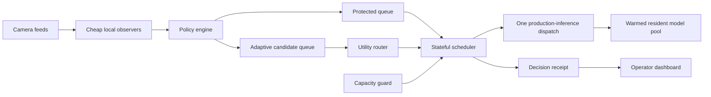

# Final elimination review playbook

## What the judges must remember

**Problem:** expensive vision inference cannot run continuously across every camera on constrained edge hardware.

**Mechanism:** cheap observation on every feed; policy-protected eligibility; learned or deterministic utility ranking; one governed production-inference dispatch; one auditable receipt.

**Evidence:** under an equal budget, the frozen learned person router produced `+35.06%` proxy utility over round robin and `+33.34%` over confidence-only on 192 deterministic replay windows.

**Feasibility:** the local prototype already runs the policy engine, scheduler, capacity guard, warmed resident detector, manual overrides, persisted receipts and live dashboard.

## Architecture explanation

The policy engine owns correctness constraints. The router never grants compute directly; it supplies a value signal for eligible work. The scheduler owns priority, waiting time, dwell, fairness and deterministic tie-breaking. The model pool prevents repeated model loading. Admission control rejects protected configurations that exceed profiled capacity.

## Pre-review sequence

### Thirty minutes before

1. Connect the laptop to power and disable sleep.
2. Close GPU-heavy and notification-heavy applications.
3. Run `run-demo.bat --check`.
4. Run `run-demo.bat` and wait for all three labelled terminals.
5. Confirm `/healthz`, `/v2/runtime` and the dashboard.
6. Confirm `V2 runtime connected`, `1 / 1 warm`, `0.2 FPS`, `12 FPS` and three visible feeds.
7. Activate and release Camera B once. Confirm all buttons return to `Take control`.
8. Keep `PITCH.md`, this playbook and the frozen results open locally.
9. Begin Windows screen recording as the backup.

### Immediately before presenting

- Return dashboard scroll to the top.
- Browser zoom: 100%.
- Confirm no override is active.
- Confirm decisions continue changing at the deliberate 0.5 decisions/second cadence.
- Do not restart anything after this point unless the dashboard disconnects.

## Judge questions and strong answers

### “Why not just round robin?”

Round robin is unaware of scene value and policy. Under the same 192-call budget, the learned person router captured 92.7979 proxy utility versus 68.7085 for round robin. CAHMA also guarantees minimum service and prevents starvation rather than trusting the score alone.

### “Why not run the heavyweight model everywhere?”

That assumes sufficient accelerator memory and throughput. CAHMA targets installations where the aggregate requested rate exceeds the affordable edge budget. It keeps models resident and allocates calls instead of duplicating expensive execution across every stream.

### “Is this only a dashboard?”

No. The backend executes policy resolution, capacity admission, stateful scheduling, resident ONNX inference, overrides and receipt persistence. The dashboard reads live WebSocket decisions and controls the actual local runtime.

### “What exactly was trained?”

A CPU HistGradientBoostingRegressor predicts the proxy value of escalating a person-detection frame from YOLOX Nano to YOLOX Tiny using compact scene and temporal signals. It ranks feeds; it does not detect people and does not own the compute token.

### “Is the v2 SAGE router trained across different tasks?”

Not yet. The live v2 policy layer truthfully reports `deterministic-observer-v2-baseline`. The trained evidence applies to person routing. Cross-task SAGE is the next controlled experiment and will replace the baseline only if it wins on held-out cameras.

### “How do you prevent starvation?”

Minimum service is protected, waiting time increases scheduling value, maximum wait is tracked, and ties resolve by longest wait then camera ID. Safety work is separated from adaptive competition.

### “What happens when the model or GPU fails?”

Readiness exposes model state, capacity admission prevents unsupported commitments, inference failure releases the allocation, and deterministic routing remains available. Production deployment still requires hardware profiling and broader failure testing.

### “Can the learned model manipulate safety decisions?”

No. Safety, active policy, manual override and required minimum service are resolved before adaptive utility. The learned component only ranks work left eligible by policy.

### “What makes this different from load balancing?”

Ordinary load balancing distributes requests already chosen for execution. CAHMA decides which potential inference call is worth creating, subject to camera policy, temporal value, fairness and model capacity, then records the reason.

### “What is the business integration path?”

Integrate the scheduler between an existing VMS/NVR event layer and its detector services. Camera workers send compact signals; raw frames remain local. Vendors can ship it as an edge SDK or orchestration service without replacing their existing models.

## Failure fallback

If video playback fails, use the visible camera cards, live scores and receipts; the scheduler does not require the browser video element. If the WebSocket disconnects, show the frozen results and architecture, then query `/v2/runtime`. If the frontend fails completely, present the three stored receipt IDs in `REVIEW1_DEMO_HANDOFF.md` and the hash-verified evidence table. Never improvise a result.

## Go/no-go checklist

- [ ] Laptop powered; sleep and notifications disabled
- [ ] Launcher preflight passes
- [ ] API and dashboard connected
- [ ] Three feeds visible
- [ ] Resident model warm; one load event
- [ ] Protected demand and safe throughput visible
- [ ] Override activation and release verified
- [ ] No active override before presentation
- [ ] Decision receipt updating
- [ ] Frozen evidence file and hashes available
- [ ] Backup screen recording started
- [ ] Presenter can state the evidence limitation in one sentence

## Current verdict

**GO for final elimination as a working, evidence-backed hackathon prototype.** The strongest defensible claim is better equal-budget proxy-utility allocation for the learned person router plus a functioning policy-protected v2 orchestration system. Cross-task learned SAGE and production detector-accuracy claims remain out of scope.
